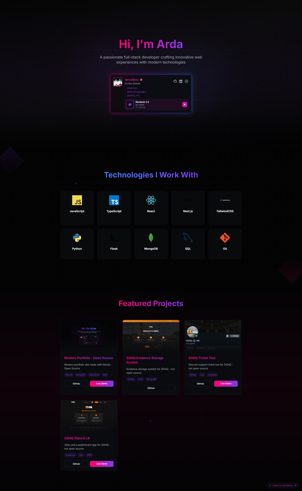

# Modern Portfolio Website

  <p align="center">
    
    A modern, animated portfolio website built with Next.js 14 and TypeScript
    <br />
    <a href="https://raikou.me"><strong>View Demo »</strong></a>
    <br />
    <br />
    <a href="https://github.com/devraikou/modern-portfolio/issues">Report Bug</a>
    ·
    <a href="https://github.com/devraikou/modern-portfolio/issues">Request Feature</a>
  </p>

  
  
  
  
</div>

## ✨ Features

- 🎨 **Modern Design**
  - Neon-themed UI with smooth animations
  - Responsive layout for all devices
  - Beautiful gradient effects
  - Smooth page transitions

- 🎮 **Discord Integration**
  - Real-time status updates via [Lanyard API](https://github.com/Phineas/lanyard)
  - Custom animated Discord card
  - Display current activity and Spotify status
  - Dynamic badge showcase

- 💼 **Project Showcase**
  - Dynamic project grid with animations
  - Technology tags
  - Live demo & GitHub links

- 🛠 **Tech Stack**
  - Next.js 14 with App Router
  - TypeScript
  - Tailwind CSS
  - Framer Motion
  - MongoDB

## 🚀 Quick Start

```bash
# Clone the repository
git clone https://github.com/devraikou/modern-portfolio.git

# Install dependencies
npm install

# Run the development server
npm run dev
```
## 🌟 Acknowledgments

- [Next.js](https://nextjs.org/)
- [Tailwind CSS](https://tailwindcss.com/)
- [Framer Motion](https://www.framer.com/motion/)
- [Lanyard API](https://github.com/Phineas/lanyard)
- [MongoDB](https://www.mongodb.com/)

## 📱 Contact

- GitHub: [devraikou](https://github.com/devraikou)
- Instagram: [ard4gulez](https://instagram.com/ard4gulez)
- LinkedIn: [ardagulez](https://linkedin.com/in/ardagulez)
- Email: [arda@raikou.me](mailto:arda@raikou.me)

## 📝 License

This project is licensed under the MIT License.

---

<p align="center">If you found this project helpful, please consider giving it a ⭐️!</p> 
